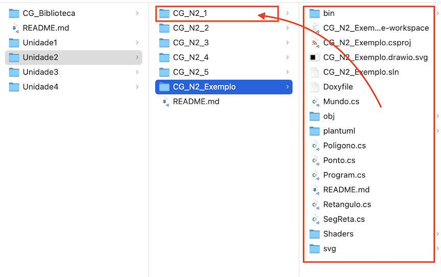
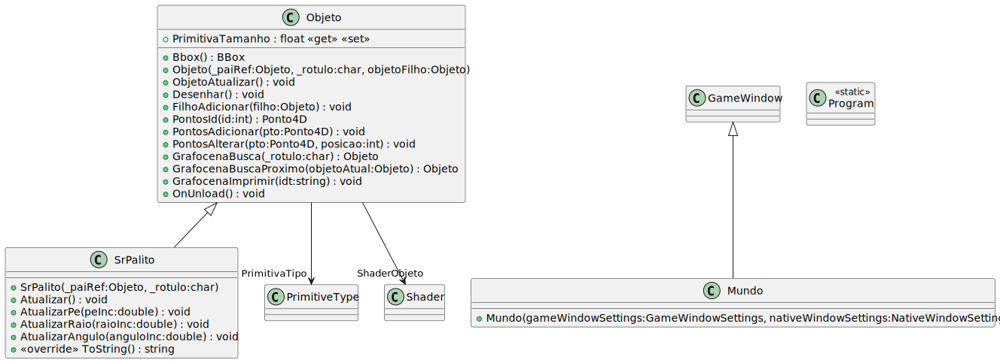

[CG_Biblioteca]:            ../../CG_Biblioteca/              "CG_Biblioteca"  
[CG_Biblioteca_Matematica]: ../../CG_Biblioteca/Matematica.cs "CG_Biblioteca_Matematica"  
[CG_N2_Exemplo]:            ../CG_N2_Exemplo/              "CG_N2_Exemplo"  

# Unidade 2: OpenGL (OpenTK) - atividade  

Lembretes:

- cada questão deste trabalho deve ser separada em novas pastas e projetos executados separadamente. Obrigatoriamente devem usar como base o projeto de exemplo **[CG_N2_Exemplo]**. Lembrem que este projeto também usa o projeto [CG_Biblioteca] disponível na pasta raiz do GitHub da equipe.
- usem as sub-pasta da Unidade2 do GitHub da sua equipe para desenvolver/entregar o seu código. No caso:
  - [atividade 1](#1-círculo-no-centro-do-sru) na pasta **CG_N2_1**  
  - [atividade 2](#2-primitivas-geométricas) na pasta **CG_N2_2**  
  - [atividade 3](#3-sr-palito-dando-seus-primeiros-passos) na pasta **CG_N2_3**  
  - [atividade 4](#4-spline) na pasta **CG_N2_4**  
  - [atividade 5](#5-bbox-dos-círculos) na pasta **CG_N2_5**  

## Inicio

Uma maneira de utilizar o exemplo **[CG_N2_Exemplo]** para criar as atividades dessa unidade seria:

1) "baixe" (melhor clonar o repositório) o repositório da disciplina (imagem da esquerda) e o repositório da sua equipe (imagem da direita). Copie/cole a pasta CG_Biblioteca, mas cuide para ser no lugar certo.  
  
2) Agora copie/cole a pasta CG_N2_Exemplo, mas novamente *cuide* para ser no lugar certo.  
  
3) E, por fim, copie/cole TODO o conteúdo da pasta CG_N2_Exemplo para a pasta do exercício em si.  
  
4) Antes de inciar a atividade teste para verificar se deu tudo certo, abrindo o arquivo CG_N2_Exemplo.code-workspace no VSCode, e executando o projeto.  

Observe que no projeto CG_N2_Exemplo tem arquivos a mais do que vai ser usado em cada exercício, se quiser esses arquivos podem ser deletados.  

## 1. Círculo no centro do SRU  

Implemente uma aplicação para desenhar um círculo no centro do Sistema de Referência do Universo (SRU), com raio de valor 0.5. Utilize 72 pontos (com um tamanho do ponto de 5) simetricamente distribuídos sobre o perímetro do círculo, de forma que o resultado final seja o mais parecido com o código: [CG_N2_1_win-x64.zip](./CG_N2_1_win-x64.zip "CG_N2_1_win-x64.zip"). Neste caso crie uma nova classe com o nome ```Circulo``` em ```Circulo.cs```, e usem como base as classes: [Ponto.cs](../CG_N2_Exemplo/Ponto.cs), [SegReta.cs](../CG_N2_Exemplo/SegReta.cs), [Retangulo.cs](../CG_N2_Exemplo/Retangulo.cs) e [Poligono.cs](../CG_N2_Exemplo/Poligono.cs).  

Observações:  

- desenhe somente os eixos positivos x e y, cada um com comprimento igual a 0.5;  
- experimente mudar a cor de fundo da tela e a cor de desenho dos pontos para ficarem igual a figura a cima;  
- utilize as funções sin(ang) e cos(ang) para calcular os pontos do círculo da Classe [CG_Biblioteca_Matematica] fornecida;  
- não é permitido usar o comando circle do OpenGL e nem outra implementação que não usem as funções da classe [CG_Biblioteca_Matematica].  

Especificação:  

  

## 2. Primitivas geométricas  

Nesta aplicação a ideia é explorar a utilização das “primitivas geométricas” de forma que o resultado final seja o mais parecido com o código: [CG_N2_2_win-x64.zip](./CG_N2_2_win-x64.zip "CG_N2_2_win-x64.zip"). Aqui se pode usar a classe [Retangulo.cs](../CG_N2_Exemplo/Retangulo.cs).  

No caso a interação deve ser:  

- para alternar entre as “primitivas geométricas” usem a tecla de “barra de espaço”;  
- as “primitivas geométricas” que devem ser utilizadas são: Points, Lines, LineLoop, LineStrip, Triangles, TriangleStrip e TriangleFan.  

Especificação:  

  

## 3. Sr. Palito, dando seus primeiros passos  

Agora, crie uma nova aplicação com o objetivo de um Segmento de Reta (SR) se transformar no Sr. "Palito". Para isto usem como base as classes [SegReta.cs](../CG_N2_Exemplo/SegReta.cs "SegReta.cs") e ```Circulo.cs``` criada no [Exercício 1](#1-círculo-no-centro-do-sru "Exercício 1").

Como o Sr. Palito está dando os seus primeiros passos por enquanto ele só consegue:  

- se mover para os lados usando as teclas Q (esquerda) e W (Direita);
- usar as teclas A (diminuir) e S (aumentar) para mudar o seu tamanho (raio);  
- usar as teclas Z (diminuir) e X (aumentar) para girar (ângulo).  

Ao Sr. Palito "nasce" está com os seus "pés" na origem, e sua "cabeça" na posição definida com raio de valor 0.5 e ângulo 45º.  

Ah ... o Sr. Palito não se parece muito com o "desenho" do [segmento de reta](../CG_N2_Exemplo/SegReta.cs) que representa um raio de uma [circunferência](#1-círculo-no-centro-do-sru) !!  

Se quiser como é o Sr. Palito "engatinhando" nos seus primeiros dias de "vida" olhem o código: [CG_N2_3_win-x64.zip](./CG_N2_3_win-x64.zip "CG_N2_3_win-x64.zip").

Especificação:  

  

## 4. Spline  

Já esta aplicação o seu objetivo é poder desenhar uma spline (curva polinomial) que permita alterar a posição (x,y) dos pontos de controle dinamicamente utilizando o teclado.  

No caso a interação deve ser:  

– para mudar entre o ponto de controle selecionado (em cor vermelha) usem a tecla de “barra de espaço”;  
– para mover o ponto selecionado (um dos pontos de controle) usar as teclas C (Cima), B (Baixo), E (Esquerda) e D (Direita);  
– as teclas do sinal de mais (+) e vírgula (,) podem aumentar e diminui a quantidade de pontos calculados na spline;  
– a spline deve ser desenha usando linhas de cor amarela;  
– o poliedro de controle deve ser desenhado usando uma linha de cor ciano.  
<!-- – ao pressionar a tecla R os pontos de controle devem voltar aos valores iniciais;   -->

**ATENÇÃO**: não é permitido usar o comando spline do OpenGL, sendo só permitido usar UMA das formas de splines “demonstradas em aula”. Ao mover um dos pontos de controle, o poliedro e a spline deve se ajustar aos novos valores deste ponto.  
Veja o exemplo no vídeo a baixo.  

Usem as classes:

- [SegReta.cs](../CG_N2_Exemplo/SegReta.cs "SegReta.cs") para desenhar o poliedro de controle;  
- [Ponto.cs](../CG_N2_Exemplo/Ponto.cs "Ponto.cs") para desenhar os pontos de controles; e  
- ```Spline.cs```, crie uma nova classe para representar o objeto gráfico Spline.  

O resultado final deve ser o mais parecido com o código: [CG_N2_4_win-x64.zip](./CG_N2_4_win-x64.zip "CG_N2_4_win-x64.zip")  

Especificação:  

  

## 5. BBox dos círculos

E por fim, esta aplicação tem o objetivo de fazer um ```joystick virtual```. Basicamente deve-se desenhar dois círculos (um menor e outro maior) e poder mover o círculo menor, mas sem deixar ele (o centro do círculo menor) sair dos limites do círculo maior. Para mover o centro do círculo menor usar as teclas C (Cima), B (Baixo), E (Esquerda) e D (Direita).  

Para controlar o movimento do centro do círculo menor deve ser usado (neste ordem):  

– um teste inicial pela BBox interna do círculo maior  
– seguido do cálculo da distância (euclidiana, sem raiz)  

  ^2+(y_{2}-y_{1})^2})  

Aqui só use as classes:

- ```Circulo.cs```: para criar os círculos maior e menor (lembre, a [atividade 1](#1-círculo-no-centro-do-sru) já criou uma classe círculo)  
- ```Ponto.cs``` ([Ponto.cs](../CG_N2_Exemplo/Ponto.cs)): para criar o ponto do centro do círculo menor  
- ```Retangulo.cs``` ([Retangulo.cs](../CG_N2_Exemplo/Retangulo.cs)): para criar a representação visual da BBox interna  

O resultado final deve ser o mais parecido com o código: [CG_N2_5_win-x64.zip](./CG_N2_5_win-x64.zip "CG_N2_5_win-x64.zip")  

Especificação:  

  

## Atenção

A avaliação da atividade envolve o desenvolvimento das questões acima apresentadas, mas o mais importante é o integrante da equipe demonstrar conhecimento além do código desenvolvido, também os conceitos apresentados em aula relacionados com a atividade em si.  
Cuide com o prazo de entrega observando o [cronograma](../../cronograma.md).

## Gabarito

  

----------

## ⏭ [Unidade 3)](../Unidade3/README.md "Unidade 3")  
